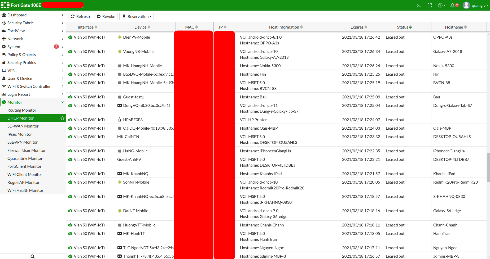

# A. Dasboard 

- Hiển thị thông tin về sản phẩm trong phần ` System information ` 
- Các bản quyền phần mềm trong ` licenses ` 
- Thông tin đăng nhập , quản lý tron ` Administrator  ` . 
- Các thông tin về phân cứng ` CPU , RAM ` .
- Thông tin về sessions ` Curent Sessions , SPU , nTurbo ` .

# B. Monitor 

## 1. Routing Monitor 
- Thông tin về các định tuyết mạng trong hệ thống . 

## 2. DHCP Monitor

> Thông tin của mỗi một thiêt bị được cấp DHCP sẽ bao gồm các trường thông tin như phía dưới :

  
- ` Interface ` : Cấp cho phân vùng Vlan hay Port , interface nào  
- ` Device ` : Device này có thể là do mình định dạng lai , hoặc là do hệ thống tự phát hiện detect ra .
- ` MAC ` : Địa chỉ MAC của thiết bị 
- ` IP ` : Địa chỉ IP được cấp DHCP 
- ` Host Information ` : Hostname của devices
- ` Expires ` : Thời gian hết hạn 
- ` Status ` : ` Leased out` trạng thái này là đang được sử dụng 

## 3. SSL- VPN , IPsec VPN 
