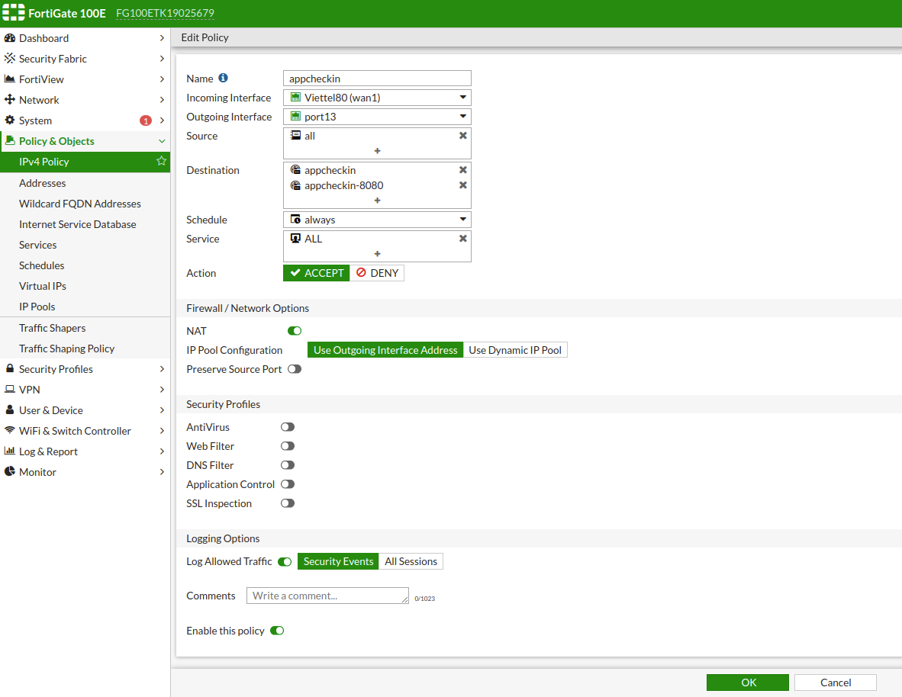

# Policy 

## 1. DNAT 
- Cấu hình nat để cho phép truy cập máy local từ ngoài internet thông qua port trên IP public .
- 1. ` Policy & Object -> Virtual IPs `
- 2. Create new virtual IP 
- 3. VIP type ( IPv4 , IPv6 , IPv46 , IPv64 )
- 3. Đặt tên và chú thích 
- 4. `Interface ` : Chọn cổng đấu nối internet .( Wan )
- 4. ` External IP Address/Range ` : Địa chỉ IP pulbic 
- 5. ` Mapped IP Address/Range ` : Địa chỉ IP local 
- 6. ` Optional Filters ` : Nếu enable trường này  , thì sẽ có một services pane ở phía dưới . 
	- ` Enable Services `: Chọn các services tương ứng với các port  ( 80 , 81 , 82 )
- 7. ` Port Forwarding ` : Port sẽ được forward chuyển tới IP local bằng port này ( 999 )
- Quá trình NAT sẽ chuyển tất cả các truy vấn tới IP public từ cổng ( 80 , 81 , 82 ) tới port ( 999 ) của IP local 

 ## 2. Tạo Virtual IP group 
- Tạo Virtual IP group để nhóm các Virtual IP nat lại .
- 1. ` Policy & Object -> Virtual IPs `
- 2. Create new Virtual ip group 
- 3. Đặt tên Group 
- 4. `Interface `: Chọn cổng đấu nối internet 
- 5. `Members `: các virtual ip được cấu hình trước đó 

## 3. Thiết lập  Virtual IP 
- Sau khi thiêt lập các Virtual IP , để có thể thực hiện truy cập được thông qua NAT ta phải thiết lập policy cho nó . 
- 1. ` Policy & Objects -> Create New ` 
- 2. ` Name ` : Đặt tên cho policy 
- 3. ` Incomming interface ` : Bên ngoài truy cập thông qua interface nào , trong trường hợp này là inteface Wan 
- 4. ` Outgoing Inteface ` : Cẩu đấu nối tới server local cần NAT ra ngoài 
- 5. ` Source ` : all 
- 6 ` Destination ` : Chọn đích tới , trong trường hợp này là để Virtual IP 
- 7. ` Schedule ` : Để Always , thì policy sẽ luôn có hiệu lực 
- 8. ` Service ` :   Chọn các dịch vụ cần NAT, có thể chọn all hoặc chọn dịch vụ tương ứng chúng ta đang NAT,
- 9. `Action ` : chọn Accept 
- 10 . ` NAT ` : Tắt NAT để có thể biết địa chỉ nguồn truy cập tới , Nếu để NAT ` "Use Outgoing Interface Address` thì địa chỉ nguồn truy cập tới luôn luôn là IP public dùng để NAT . 

## 4. Thiết lập Policy 

- ` Name ` : Tên của policy 
- ` Incomming interface `  : Dữ liệu nguồn từ inteface nào  
- ` Outgoing interface ` : Dữ liệu out tới interface nào 
- ` Source ` :  Chọn lựa thiết bị được sử dụng chính sáh 
- ` Destination ` : All là đến tất cả các máy tính phía ngoài outgoing interface 
- ` Scheduler ` : Chinh sách luôn áp dụng , luôn có hiệu lực 
- ` Service ` : Dịch vụ được sử dụng trong chính sách 

## 5. Address 
- Address thiết lập một đỉa chỉ hoặc một dải địa chỉ với một tên tương ứng , gợi nhớ và dễ dàng sử dụng . 

